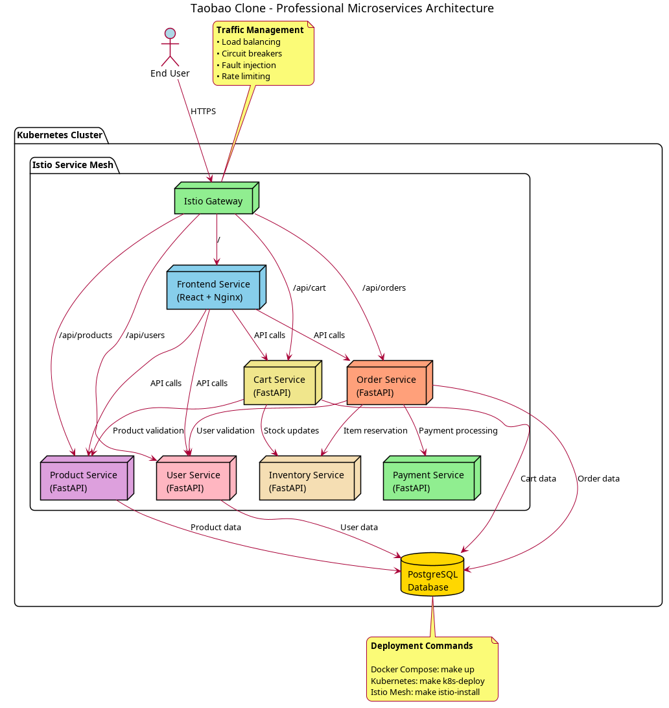

# Taobao Clone - Microservices with Istio

A full-stack e-commerce platform clone built with modern microservices architecture, designed as a learning project to explore **Istio service mesh** capabilities on Kubernetes.



## 🏗️ Architecture Overview

This project implements a **microservices architecture** with the following components:

### Frontend
- **React** application with modern UI
- **Nginx** reverse proxy for API routing
- Containerized for consistent deployment

### Backend Services (FastAPI)
- **User Service** - Authentication and user management
- **Product Service** - Product catalog management  
- **Cart Service** - Shopping cart operations
- **Order Service** - Order processing and workflow
- **Payment Service** - Payment processing and validation
- **Inventory Service** - Stock management and reservations

### Infrastructure
- **PostgreSQL** database with separate schemas per service
- **Kubernetes** orchestration with service discovery
- **Istio** service mesh for advanced traffic management
- **Docker** containerization for all services

## 🚀 Getting Started

### Prerequisites
- **Docker** and **Docker Compose**
- **Kubernetes** cluster (minikube for local development)
- **kubectl** CLI tool
- **istioctl** CLI tool (for service mesh features)

### Quick Start

#### 1. Local Development (Docker Compose)
```bash
# Build and start all services
make build
make up

# Access the application
# Frontend: http://localhost:3000
# API services: http://localhost:8001-8006

# View logs
make logs

# Stop services
make down
```

#### 2. Kubernetes Deployment
```bash
# Start minikube cluster
minikube start

# Deploy to Kubernetes
make k8s-deploy

# Check deployment status
kubectl get pods
kubectl get services

# Access frontend
minikube service frontend-service --url
```

#### 3. Istio Service Mesh (Advanced)
```bash
# Install Istio
make istio-install

# Deploy Istio configurations
make istio-deploy

# Access Istio features
# - Traffic management
# - Security policies (mTLS)
# - Observability and tracing
```

## 📋 Available Commands

All commands are available through the **Makefile**:

### Docker Compose
- `make build` - Build all containers
- `make up` - Start all services locally
- `make down` - Stop all services  
- `make logs` - View service logs
- `make clean` - Clean up containers and volumes

### Kubernetes  
- `make k8s-deploy` - Deploy to Kubernetes
- `make k8s-delete` - Remove from Kubernetes

### Istio Service Mesh
- `make istio-install` - Install Istio and enable injection
- `make istio-deploy` - Deploy Istio configurations

### Development
- `make dev-frontend` - Start React development server
- `make dev-user-service` - Start user service in dev mode
- `make dev-product-service` - Start product service in dev mode

## 🛠️ Project Structure

```
Taobao/
├── frontend/                 # React frontend with Nginx
│   ├── src/                 # React source code  
│   ├── nginx/               # Nginx configuration
│   ├── package.json         # Frontend dependencies
│   └── Dockerfile          # Frontend container build
├── services/                # FastAPI microservices
│   ├── user-service/        # User authentication & management
│   ├── product-service/     # Product catalog
│   ├── cart-service/        # Shopping cart
│   ├── order-service/       # Order processing
│   ├── payment-service/     # Payment handling
│   └── inventory-service/   # Inventory management
├── k8s/                     # Kubernetes configurations
│   ├── deployments/         # Service deployments
│   ├── services/           # Service definitions
│   ├── istio/              # Istio configurations
│   └── configmaps/         # Configuration maps
├── docker-compose.yml       # Local development setup
├── Makefile                # Build and deployment commands
└── architecture-diagram.png # Project architecture
```

## 🔧 Service Details

### API Endpoints

Each service exposes RESTful APIs:

- **User Service** (`localhost:8001`) - `/health`, `/users`, `/users/register`, `/users/login`
- **Product Service** (`localhost:8002`) - `/health`, `/products`, `/products/{id}`  
- **Cart Service** (`localhost:8003`) - `/health`, `/cart/{user_id}`, `/cart/{user_id}/items`
- **Order Service** (`localhost:8004`) - `/health`, `/orders`, `/orders/{id}`
- **Payment Service** (`localhost:8005`) - `/health`, `/payments`
- **Inventory Service** (`localhost:8006`) - `/health`, `/inventory/{product_id}`

### Database Schema

PostgreSQL with dedicated schemas:
- `userdb` - User accounts and authentication
- `productdb` - Product catalog and details
- `cartdb` - Shopping cart sessions  
- `orderdb` - Order history and transactions

## 🌐 Service Communication

The architecture implements several communication patterns:

### Frontend → Backend
- React app calls REST APIs via Nginx proxy
- Routes: `/api/users`, `/api/products`, `/api/cart`, `/api/orders`

### Inter-Service Communication  
- **Cart Service** ↔ Product Service (product validation)
- **Cart Service** ↔ Inventory Service (stock management)
- **Order Service** → Payment Service (payment processing)
- **Order Service** → Inventory Service (item reservation)
- **Order Service** → User Service (user validation)

## 🔒 Istio Features

When deployed with Istio, the project demonstrates:

### Traffic Management
- **Virtual Services** for advanced routing rules
- **Destination Rules** for load balancing strategies
- **Gateway** for external traffic management
- **Circuit breakers** and fault injection

### Security
- **Mutual TLS (mTLS)** between all services
- **Authorization policies** for access control
- **JWT validation** for user authentication

### Observability  
- **Distributed tracing** with Jaeger
- **Metrics collection** with Prometheus
- **Service mesh visualization** with Kiali
- **Access logging** and monitoring

## 📊 Learning Outcomes

This project helps you learn:

1. **Microservices Architecture** - Service decomposition, communication patterns
2. **Containerization** - Docker best practices, multi-stage builds  
3. **Kubernetes Orchestration** - Deployments, services, configuration management
4. **Istio Service Mesh** - Traffic management, security, observability
5. **DevOps Practices** - CI/CD patterns, infrastructure as code

## 🐛 Troubleshooting

### Common Issues

**Frontend crashes in Kubernetes:**
```bash
# Check if all services are deployed
kubectl get services

# Verify service endpoints are available
kubectl get pods
```

**Service connection issues:**
```bash
# Check service logs
kubectl logs deployment/user-service

# Test service connectivity  
kubectl port-forward service/user-service 8001:8000
curl http://localhost:8001/health
```

**Istio sidecar not injecting:**
```bash
# Ensure namespace has Istio injection enabled
kubectl label namespace default istio-injection=enabled

# Restart deployments to inject sidecars
kubectl rollout restart deployment --all
```

## 📚 References

- [Istio Documentation](https://istio.io/latest/docs/)
- [Kubernetes Documentation](https://kubernetes.io/docs/)
- [FastAPI Documentation](https://fastapi.tiangolo.com/)
- [React Documentation](https://react.dev/)

## 📄 License

This project is licensed under the MIT License - see the [LICENSE](LICENSE) file for details.

## 🤝 Contributing

This is a learning project, but contributions are welcome! Please feel free to submit issues and enhancement requests.

---

**Built with ❤️ for learning Istio and microservices architecture**